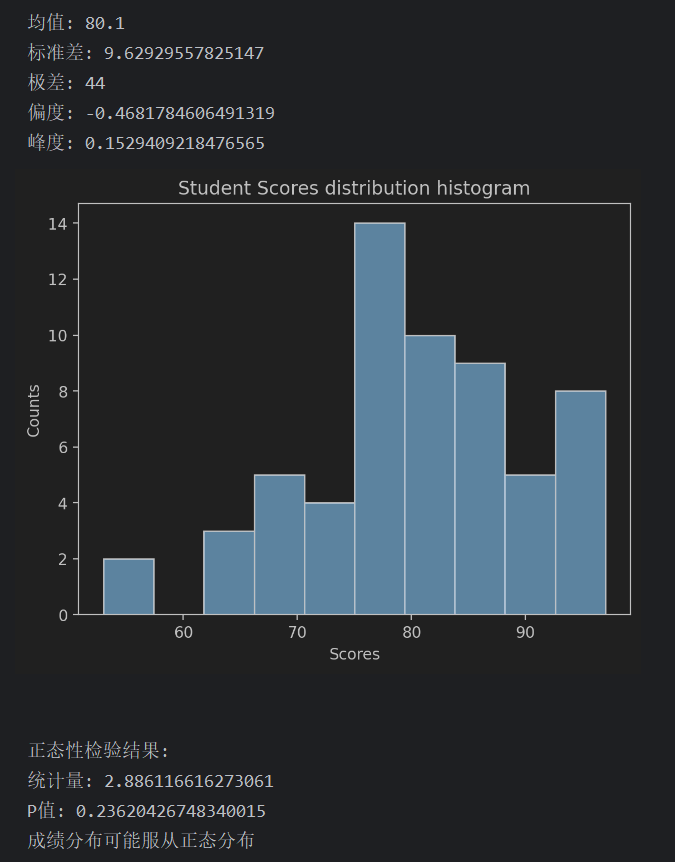
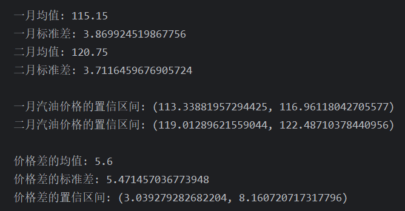
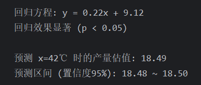
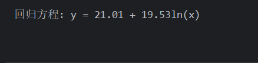
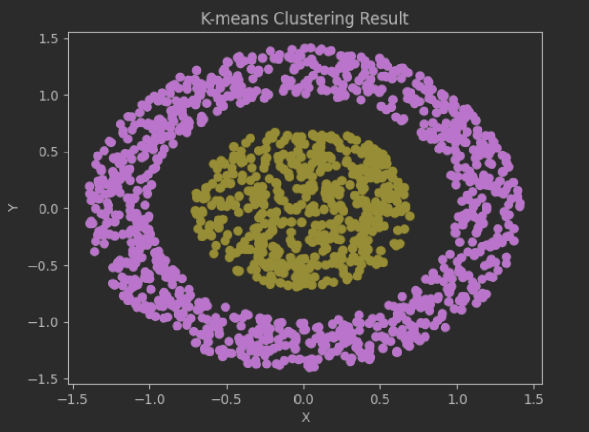

# 数学建模 第五次实验

专业班级：提高2201班
姓名： 王翎羽
学号： U202213806

## 实验工具
语言:Python
依赖项: numpy、matplotlib、scipy、sklearn
## Problem 1
### 代码
```python
import numpy as np  
import matplotlib.pyplot as plt  
from scipy import stats  
  
# 学生成绩数据  
scores = np.array([93, 75, 83, 93, 91, 85, 84, 82, 77, 76, 77, 95, 94, 89, 91, 88, 86, 83, 96, 81, 79, 97,  
78, 75, 67, 69, 68, 84, 83, 81, 75, 66, 85, 70, 94, 84, 83, 82, 80, 78, 74, 73, 76, 70,  
86, 76, 90, 89, 71, 66, 86, 73, 80, 94, 79, 78, 77, 63, 53, 55])  
  
# 计算均值、标准差、极差、偏度、峰度  
mean = np.mean(scores)  
std_dev = np.std(scores)  
range_score = np.max(scores) - np.min(scores)  
skewness = stats.skew(scores)  
kurtosis = stats.kurtosis(scores)  
  
print("均值:", mean)  
print("标准差:", std_dev)  
print("极差:", range_score)  
print("偏度:", skewness)  
print("峰度:", kurtosis)  
  
# 画直方图  
plt.figure(dpi=200)  
plt.hist(scores, bins=10, edgecolor='black')  
plt.xlabel('Scores')  
plt.ylabel('Counts')  
plt.title('Student Scores distribution histogram')  
plt.show()  
  
# 正态性检验  
statistic, p_value = stats.normaltest(scores)  
print("\n正态性检验结果:")  
print("统计量:", statistic)  
print("P值:", p_value)  
  
if p_value < 0.05:  
print("成绩分布不服从正态分布")  
else:  
print("成绩分布可能服从正态分布")
```
### 结果

## Problem 2
### 代码
```python
import numpy as np  
from scipy import stats  
  
# 一月和二月的汽油价格数据  
january_prices = np.array([119, 117, 115, 116, 112, 121, 115, 122, 116, 118, 109, 112, 119, 112, 117, 113, 114, 109, 109, 118])  
february_prices = np.array([118, 119, 115, 122, 118, 121, 120, 122, 128, 116, 120, 123, 121, 119, 117, 119, 128, 126, 118, 125])  
  
# 计算均值和标准差  
mean_january = np.mean(january_prices)  
mean_february = np.mean(february_prices)  
std_dev_january = np.std(january_prices, ddof=1)  
std_dev_february = np.std(february_prices, ddof=1)  
  
print("一月均值:", mean_january)  
print("一月标准差:", std_dev_january)  
print("二月均值:", mean_february)  
print("二月标准差:", std_dev_february)  
  
# 计算置信区间  
confidence_interval_january = stats.t.interval(0.95, len(january_prices) - 1, loc=mean_january, scale=std_dev_january/np.sqrt(len(january_prices)))  
confidence_interval_february = stats.t.interval(0.95, len(february_prices) - 1, loc=mean_february, scale=std_dev_february/np.sqrt(len(february_prices)))  
  
print("\n一月汽油价格的置信区间:", confidence_interval_january)  
print("二月汽油价格的置信区间:", confidence_interval_february)  
  
# 计算价格差的置信区间  
price_diff = february_prices - january_prices  
mean_diff = np.mean(price_diff)  
std_dev_diff = np.std(price_diff, ddof=1)  
confidence_interval_diff = stats.t.interval(0.95, len(price_diff) - 1, loc=mean_diff, scale=std_dev_diff/np.sqrt(len(price_diff)))  
  
print("\n价格差的均值:", mean_diff)  
print("价格差的标准差:", std_dev_diff)  
print("价格差的置信区间:", confidence_interval_diff)
```
### 结果

## Problem 3
### 代码
```python
import numpy as np  
from scipy import stats  
  
# 温度和产量数据  
temperature = np.array([20, 25, 30, 35, 40, 45, 50, 55, 60, 65])  
yield_data = np.array([13.2, 15.1, 16.4, 17.1, 17.9, 18.7, 19.6, 21.2, 22.5, 24.3])  
  
# 线性回归  
slope, intercept, r_value, p_value, std_err = stats.linregress(temperature, yield_data)  
  
# 打印回归方程  
print("回归方程: y = {:.2f}x + {:.2f}".format(slope, intercept))  
  
# 检验回归效果  
alpha = 0.05 # 置信水平为95%  
if p_value < alpha:  
print("回归效果显著 (p < {:.2f})".format(alpha))  
else:  
print("回归效果不显著 (p >= {:.2f})".format(alpha))  
  
# 预测 x=42℃ 时的产量估值和置信区间  
x_pred = 42  
y_pred = slope * x_pred + intercept  
slope_std_err = std_err * np.sqrt(1/len(temperature) + (x_pred - np.mean(temperature))**2 / np.sum((temperature - np.mean(temperature))**2))  
t_value = stats.t.ppf(1 - alpha/2, len(temperature) - 2)  
confidence_interval = t_value * slope_std_err  
  
print("\n预测 x={}℃ 时的产量估值: {:.2f}".format(x_pred, y_pred))  
print("预测区间 (置信度95%): {:.2f} ~ {:.2f}".format(y_pred - confidence_interval, y_pred + confidence_interval))
```
### 结果

## Problem 4
### 代码
```python
import numpy as np  
from scipy import stats  
from scipy.optimize import curve_fit  
  
x = np.array([2, 3, 4, 5, 7, 9, 12, 14, 17, 21, 28, 56])  
y = np.array([35, 42, 47, 53, 59, 65, 68, 73, 76, 82, 86, 99])  
  
def model(x, a, b):  
return a + b * np.log(x)  
  
params, covariance = curve_fit(model, x, y)  
    
a, b = params  
    
print("回归方程: y = {:.2f} + {:.2f}ln(x)".format(a, b))
```
### 结果

## Problem 5
### 代码
```python
import scipy.io as scio
import numpy as np
import matplotlib.pyplot as plt
from sklearn.cluster import KMeans

# 从 MATLAB 文件中加载数据
data = scio.loadmat('L6data.mat')['X']

def change_polar(coords):
    radius = np.sqrt(coords[:, 0]**2 + coords[:, 1]**2)
    angle = np.arctan2(coords[:, 1], coords[:, 0])
    return np.vstack((radius, angle)).T

polar_coords = change_polar(data)

# 使用极坐标聚类
radius_data = polar_coords[:, 0].reshape(-1, 1)

num_clusters = 2
kmeans_model = KMeans(n_clusters=num_clusters, random_state=0).fit(radius_data)
cluster_labels = kmeans_model.labels_

plt.scatter(data[:, 0], data[:, 1], c=cluster_labels, dpi=200)
plt.title('K-means Clustering Result')
plt.xlabel('X')
plt.ylabel('Y')
plt.show()


```
### 结果

