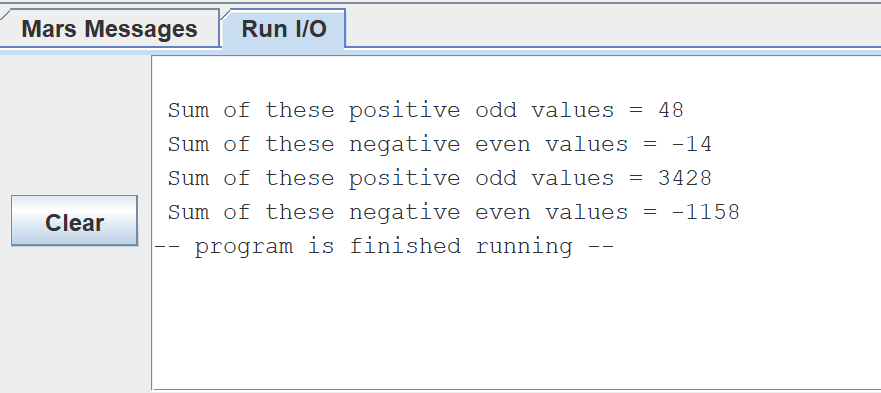

# 实验一：MIPS汇编程序设计

专业班级：**提高2201班**

姓名：        **王翎羽**

学号：        **U202213806**

## 实验名称

MIPS汇编程序设计

## 实验目的：

1. 熟悉常见的MIPS汇编指令
2. 掌握MIPS汇编程序设计
3. 了解MIPS汇编语言与机器语言之间的对应关系
4. 了解C语言语句与汇编指令之间的关系
5. 掌握MARS的调试技术
6. 掌握程序的内存映像

## 实验环境

***Mars MIPS汇编编译器***、***Windows 11操作系统***

## 实验任务

- 编写子程序PENO(&X,N,SP,SN)求长度为N 的字类型数组X中所有正奇数的和和所有负偶数的和，并分别保存到SP和SN中。已知a0保存X的地址，a1保存数组长度N，正奇数的和保存在v0,负偶数的和保存在v1中。并编写主程序验证子程序功能,要求将计算结果输出到console。

- 测试以下数组序列

​	int X[10]={1,-4,8,-9,5,6,-10,19,22,23};

​	int X[10]={121,-124,138,-199,255,2566,-1034,1019,2032,2033};  


## 实验思路

1. 在主程序中，首先打印提示信息，然后调用FUNC函数分别计算两个数组中的正奇数和负偶数的和，并打印结果。
2. FUNC函数中，使用循环遍历数组中的每个元素，判断元素的正负和奇偶性，并将符合条件的元素加到相应的和中。
3. 循环直到遍历完数组所有元素，最后返回主程序继续执行。  

### 细节思考

- 由于寄存器v0需要用来控制syscall指令的操作，所以我改用寄存器s0和s1来存储计算后的结果。
- 在判断元素的奇偶性时，采用最后一位和1进行与运算，运算结果为1，说明为偶数，反之为奇数。

## 实验源代码及注释

```mips
.data
	array1:.word 1,-4,8,-9,5,6,-10,19,22,23
	array2:.word 121,-124,138,-199,255,2566,-1034,1019,2032,2033
	
	msg1: .asciiz "\n Sum of these positive odd values = "
	msg2: .asciiz "\n Sum of these negative even values = "
	
	.globl main
	
.text

main:
	# Print message for sum of positive odd values in array1
	li $v0, 4
	la $a0, msg1
	syscall

	# Initialize address entry parameters for array1
	la $a0, array1
	li $a1, 10
	jal FUNC

	# Print sum of positive odd values in array1
	move $a0, $s0
	li $v0, 1
	syscall

	# Print message for sum of negative even values in array1
	li $v0, 4
	la $a0, msg2
	syscall

	# Print sum of negative even values in array1
	move $a0, $s1
	li $v0, 1
	syscall

	# Print message for sum of positive odd values in array2
	li $v0, 4
	la $a0, msg1
	syscall

	# Initialize address entry parameters for array2
	la $a0, array2
	li $a1, 10
	jal FUNC

	# Print sum of positive odd values in array2
	move $a0, $s0
	li $v0, 1
	syscall

	# Print message for sum of negative even values in array2
	li $v0, 4
	la $a0, msg2
	syscall

	# Print sum of negative even values in array2
	move $a0, $s1
	li $v0, 1
	syscall

	# Exit the program
	li $v0, 10
	syscall

	# Function to calculate sum of positive odd and negative even numbers
	FUNC:
		# Initialize $s0 and $s1 to store the sums
  		li $s0, 0
  		li $s1, 0
	loop:
  	 	blez $a1, return 	# If counter is less than 1, return and exit loop
   		addi $a1, $a1, -1
    	lw $t0, 0($a0)
   		addi $a0, $a0, 4
   	 	bltz $t0, negative_even 	# Check if number is less than 0
    	bgtz $t0, positive_odd 	# Check if number is greater than 0
   		j loop

	negative_even:
		# Add negative even number to sum
    	andi $t1, $t0, 1
   	 	bne $t1, $0, loop
  	  	add $s1, $s1, $t0
  	  	j loop

	positive_odd:
		# Add positive odd number to sum
  	  	andi $t1, $t0, 1
   	 	beq $t1, $0, loop
   	 	add $s0, $s0, $t0
   	 	j loop

	return:
		jr $ra 	# Return

```

## 实验结果

### 程序代码段映像

  


### 输入输出端口测试



### 程序数据段映像


### 结果分析

从I/O端口输出得到的结果正确，满足实验要求。

## 实验小结

   本次实验我使用了Mars软件进行汇编语言的练习，学会了使用syscall来进行数据的输出，最后实验结果正确，收获很大！写代码的过程中我也感受到了在C语言中一行代码就可以完成的工作，在汇编语言中可能就需要好几行才能完成。这让我更深刻理解了高级语言的代码可读性和开发效率方面上的巨大优势。
